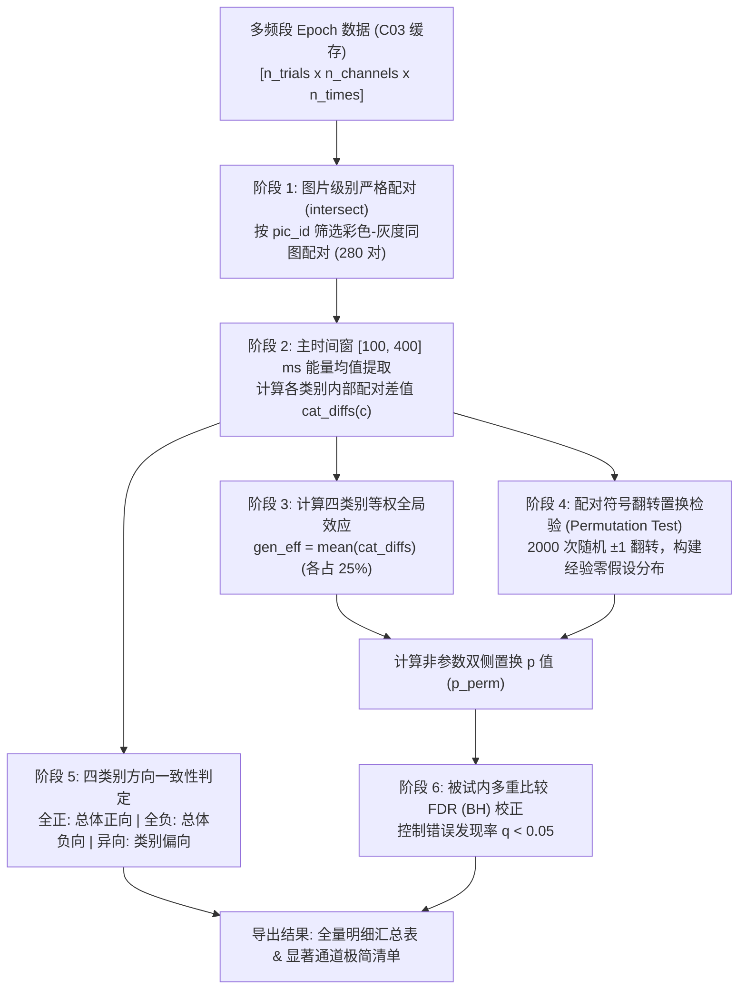

# C04 全频段色彩效应统计检验全流程详解

> **脚本来源**：[C04_screen_color_channels_0825.m](file:///e:/liulab_project/Project_colorieeg_2026/color_analyse_0825/matlab/C04_screen_color_channels_0825.m)  
> **核心任务**：对每个被试、每个植入电极通道、每个频段（Theta, Alpha, Beta, Low Gamma, High Gamma 等），严格检验刺激诱发的脑电响应是否存在**真正对“颜色”敏感的特异性效应**。

---

## 1. 统计检验设计全景流程图

整个检验流程可以划分为 6 个严密衔接的阶段：



---

## 2. 阶段详解与数学原理

### 阶段 1：图片级别严格配对（Within-Image Pairing）

* **对应代码**：第 90–97 行
  ```matlab
  col_pair_idx = cell(1, 4);
  gry_pair_idx = cell(1, 4);
  for c = 1:4
      tc = find(trial_info.trigger == cat_trig_col(c));
      tg = find(trial_info.trigger == cat_trig_gry(c));
      [~, ic, ig] = intersect(trial_info.pic_id(tc), trial_info.pic_id(tg));
      col_pair_idx{c} = tc(ic);
      gry_pair_idx{c} = tg(ig);
  end
  ```
* **科学设计原理**：
  * 实验名义上有 4 个类别（人脸、物体、身体、场景），每个类别包含 70 张独特图片。每张图片有彩色版和灰度版各一次，随机打乱呈现。
  * **消除混淆变量**：如果不配对，彩色物体与灰度人脸做对比，混杂了物体的几何轮廓、空间频率以及高级语义差异。通过 `intersect(pic_id)`，严格保证每一对对比都是**“同一张图片自己减自己”**。
  * **容错与维度对齐**：若因脑电伪迹或硬件丢步导致某图片只记录到彩色、丢失了灰度（如 sub001 记录了 556 个试次，缺失 4 个），`intersect` 会自动过滤无配对的孤儿试次，确保提取出的彩色向量和灰度向量长度完全相等。

---

### 阶段 2 & 3：四类别等权全局效应计算（Macro-Averaging）

* **对应代码**：第 111–126 行
  ```matlab
  cat_diffs = zeros(1, 4);
  all_c_vals = [];
  all_g_vals = [];

  for c = 1:4
      c_trials = mean(ch_epoch(col_pair_idx{c}, win_mask), 2);
      g_trials = mean(ch_epoch(gry_pair_idx{c}, win_mask), 2);
      cat_diffs(c) = mean(c_trials - g_trials, 'omitnan');
      all_c_vals = [all_c_vals; c_trials];
      all_g_vals = [all_g_vals; g_trials];
  end

  % 四类别等权色彩效应
  gen_eff = mean(cat_diffs);
  ```
* **数学计算步骤**：
  1. **主分析窗口**：设定为刺激呈现后 $[100, 400]\text{ ms}$，这是视觉腹侧通路进行色彩加工与前馈特征整合的核心黄金时窗。
  2. **一阶平均（类别内差异）**：对第 $c$ 个类别（$c \in \{1, 2, 3, 4\}$），计算其内部 $N_c$ 对同图试次的平均差异：
     $$\overline{\Delta}_c = \frac{1}{N_c} \sum_{i=1}^{N_c} \left( x_{c, i}^{\text{col}} - x_{c, i}^{\text{gry}} \right)$$
  3. **二阶平均（跨类别等权）**：
     $$\text{gen\_eff} = \frac{1}{4} \sum_{c=1}^4 \overline{\Delta}_c = 0.25 \times \overline{\Delta}_{\text{Face}} + 0.25 \times \overline{\Delta}_{\text{Object}} + 0.25 \times \overline{\Delta}_{\text{Body}} + 0.25 \times \overline{\Delta}_{\text{Place}}$$
  * **核心目的**：保证四大类别在总体指标中权重完全相等（各占 25%），不会因为某类别试次稍多（如 70 对 vs 69 对）或某类别能量基线过高而主导结果。

---

### 阶段 4：非参数配对符号翻转置换检验（Permutation Test）

* **对应代码**：第 128–136 行
  ```matlab
  % 配对检验
  paired_diffs = all_c_vals - all_g_vals;
  n_pairs = numel(paired_diffs);

  % 配对符号翻转置换检验
  rng(sub_idx * 100 + b);
  signs = (rand(n_pairs, cfg.n_perm) > 0.5) * 2 - 1;
  perm_diffs = mean(paired_diffs .* signs, 1);
  p_perm = (sum(abs(perm_diffs) >= abs(gen_eff)) + 1) / (cfg.n_perm + 1);
  sub_raw_pvals(ch) = p_perm;
  ```
* **为什么使用置换检验（而不是传统配对 t 检验）？**
  * 脑电频段能量（尤其是 High Gamma 等高频）分布通常具有偏度（Skewness），不完全服从高斯正态分布。
  * 置换检验属于非参数统计（Nonparametric），无需任何数据分布假定，检验结果客观可信。
* **零假设（$H_0$）与符号翻转逻辑**：
  * **零假设**：当前通道在该频段对“彩色”与“灰度”没有任何系统性偏好。
  * 如果零假设成立，那么对于任意一对图片，其彩色响应高于灰度或低于灰度纯属随机偶然，差值 $x^{\text{col}} - x^{\text{gry}}$ 冠以正号（$+1$）或负号（$-1$）的概率是严格对称且等可能的（各 50%）。
* **具体算法步骤**：
  1. 构建全样本成对差值向量 $\mathbf{d} = \mathbf{x}^{\text{col}} - \mathbf{x}^{\text{gry}}$，长度为 $N_{\text{pairs}}$（约 276~280 对）。
  2. 生成 $N_{\text{pairs}} \times K$（$K = 2000$ 次）的随机符号矩阵 $\mathbf{S}$，元素 $s_{i, k} \in \{-1, +1\}$。
  3. 计算第 $k$ 次置换下的伪效应均值：
     $$\text{perm\_diff}_k = \frac{1}{N_{\text{pairs}}} \sum_{i=1}^{N_{\text{pairs}}} s_{i, k} \cdot d_i$$
     这构成了零假设下效应量分布直方图（对称分布在 0 的两侧）。
  4. **双侧 $p$ 值计算**：
     $$p_{\text{perm}} = \frac{\sum_{k=1}^K \mathbb{I}\left( |\text{perm\_diff}_k| \ge |\text{gen\_eff}| \right) + 1}{K + 1}$$
     * 分子分母同时 $+1$ 是置换检验的标准连续性修正（Phipson & Smyth, 2010），严谨避免因零分布无超越样本导致 $p=0$ 的数学谬误。

---

### 阶段 5：四类别方向一致性分类（Concordance Categorization）

* **对应代码**：第 138–145 行
  ```matlab
  % 方向一致性分类
  if all(cat_diffs > 0)
      concord_type = 'Concordant_Positive';
  elseif all(cat_diffs < 0)
      concord_type = 'Concordant_Negative';
  else
      concord_type = 'Category_Biased';
  end
  ```
* **为什么需要这个分类？**
  * 统计上的 `gen_eff` 是均值。有可能出现一种情况：某电极仅对“人脸”有超强响应（人脸差值 $+8\text{ dB}$），但在物体、身体、场景上差值几乎为 0 甚至略微为负（$-1\text{ dB}$）。平均下来 `gen_eff` 依然很大且 $p < 0.05$。
  * 但从神经机制来看，这种电极实际上是“人脸偏好电极”，而不是“通用色彩电极”。
* **三类分类规则**：
  1. **Concordant_Positive（总体正向增强）**：$\overline{\Delta}_{\text{Face}} > 0$ 且 $\overline{\Delta}_{\text{Object}} > 0$ 且 $\overline{\Delta}_{\text{Body}} > 0$ 且 $\overline{\Delta}_{\text{Place}} > 0$。四大类别全部呈现彩色能量高于灰度，这是最干净、最核心的色彩特异性激活通道。
  2. **Concordant_Negative（总体负向抑制）**：四大类别差值全部小于 0。呈现为色彩诱发的去同步化或抑制响应。
  3. **Category_Biased（不同向 / 类别偏好）**：四大类别差值正负不一，表明该通道受类别语义调控较大。

---

### 阶段 6：被试内多重比较 FDR 校正（Benjamini-Hochberg）

* **对应代码**：第 173–181 行及第 243–271 行的 `fdr_bh` 函数
  ```matlab
  % 被试内 FDR (Benjamini-Hochberg) 校正
  [~, ~, ~, p_fdr] = fdr_bh(sub_raw_pvals, cfg.alpha_sig);

  for ch = 1:n_ch
      sub_ch_recs{ch}.p_fdr = p_fdr(ch);
      sub_ch_recs{ch}.is_significant = (sub_ch_recs{ch}.p_perm_100_400ms < cfg.alpha_sig);
      sub_ch_recs{ch}.is_fdr_sig     = (p_fdr(ch) < cfg.alpha_sig);
      all_records = [all_records; sub_ch_recs{ch}];
  end
  ```
* **校正必要性**：
  * 一个被试在大脑不同解剖位置植入了 $M$ 个通道（例如 80~150 个）。如果在 $\alpha = 0.05$ 下对 100 个通道分别检验，纯靠运气就可能产生 $100 \times 0.05 = 5$ 个假阳性。
* **FDR (BH) 算法机制**：
  1. 将当前被试在该频段下所有 $M$ 个通道的原始置换 $p$ 值按升序排列：
     $$p_{(1)} \le p_{(2)} \le \dots \le p_{(M)}$$
  2. 针对每个序号 $i \in \{1, 2, \dots, M\}$，计算动态放宽的临界阈值：
     $$T_i = \frac{i}{M} \cdot q \quad (q = 0.05)$$
  3. 找到满足 $p_{(i)} \le T_i$ 的最大序号 $k$：
     $$k = \max \left\{ i : p_{(i)} \le \frac{i}{M} q \right\}$$
  4. 将所有序号满足 $i \le k$ 的通道判定为 FDR 显著。
* **代码双重标记**：
  * `is_significant`：基于原始置换 $p_{\text{perm}} < 0.05$（保留高灵敏度候选）；
  * `is_fdr_sig`：基于 FDR 校正后 $p_{\text{fdr}} < 0.05$（最严格的假阳性控制标准）。

---

## 3. 最终汇总与极简输出表结构

为了让后续检查与下游分析一目了然，脚本将分析结果整理并输出：

```matlab
simple_table = table();
simple_table.subject           = sig_sub_table.subject;           % 被试 ID (如 sub001)
simple_table.channel           = sig_sub_table.channel;           % 中心通道名 (如 G12)
simple_table.freq_band         = sig_sub_table.freq_band;         % 频段 (如 High_Gamma)
simple_table.significance_type = sig_type_map;                    % 总体正向 / 总体负向 / 不同向
simple_table.general_effect_dB = round(sig_sub_table.general_effect_dB, 3);  % 全局色彩效应 (dB)
simple_table.p_perm            = round(sig_sub_table.p_perm_100_400ms, 4);  % 置换 p 值
simple_table.p_fdr             = round(sig_sub_table.p_fdr, 4);             % FDR 校正 p 值
simple_table.dkt_anatomy       = sig_sub_table.dkt_anatomy;       % DKT 解剖定位 (如 fusiform)
```

* **导出文件路径**：
  * 极简清单：`color_analyse_0825/result/tables/color_significant_channels_simple.csv`
  * 全量明细：`color_analyse_0825/result/tables/color_effects_summary.csv`
  * 兼容备份：`color_analyse_0825/metadata/C04_全频段色彩统一效应汇总.csv`

---

## 4. 关键设计亮点总结（核对清单）

1. **同图配对**：利用 `intersect` 将每个刺激的彩色试次与自身的灰度试次一一锁死，消除低层图形与高级语义干扰，自动处理孤儿试次。
2. **两级均值（四类等权）**：先类别内求均值，再类别间无权重算术平均，四类别各占 25%，防止大类偏倚或试次量轻微差异导致的偏袒。
3. **配对非参数符号翻转检验**：针对非正态脑电功率，利用 2000 次符号翻转构建真实零分布，保证统计检验严格有效。
4. **一致性分类**：从机制上区分“全类别同向色彩增强”与“局部类别语义偏向”。
5. **FDR 多重比较校正**：有效压制百级通道多重检验的假阳性率。
