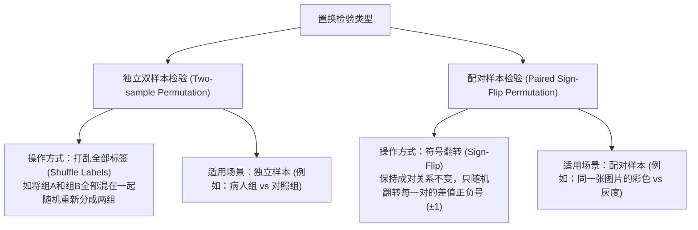

# 非参数配对符号翻转置换检验（Sign-Flip Permutation Test）详解

> **核心定义**：  
> **配对符号翻转置换检验**（Paired Sign-Flip Permutation Test）是一种专门针对**成对实验设计（Paired Design）**的高效非参数统计方法。它通过在零假设下**随机翻转配对差值的正负号（$\pm 1$）**来模拟零分布，完全摆脱了传统配对 $t$ 检验对数据服从正态分布的严格假定，是脑电、MEG、sEEG 及神经影像学中公认的金标准检验方法之一。

---

## 1. 为什么叫“配对符号翻转”？（生活直觉与核心思想）

### 1.1 什么是“配对”（Paired）？
在我们的实验设计中，每个测试对象（一张特定的图片）都会在两种条件下呈现：
- 条件 A：**彩色版**（Color）
- 条件 B：**灰度版**（Gray）

我们关心的不是彩色单独的绝对能量，也不是灰度单独的绝对能量，而是**同一张图片**在两种条件下的**成对差值（Paired Difference）**：
$$d_i = x_{i}^{\text{col}} - x_{i}^{\text{gry}} \quad (i = 1, 2, \dots, N)$$

### 1.2 为什么是“翻转正负号”（Sign-Flip）？
在统计学中，我们首先设立一个**零假设（$H_0$）**：
> **$H_0$（无效应）**：当前脑区对颜色**根本没有特异性响应**，大脑测到的彩色能量和灰度能量差异纯粹是**自发脑电背景噪声**引起的随机波动。

如果零假设成立：
1. “彩色”和“灰度”在本质上只是两个毫无意义的随意标签，它们完全可以**等概率互换**（Exchangeability）。
2. 对于第 $i$ 张图片：
   - 如果保持原标签：差值为 $d_i = x_{i}^{\text{col}} - x_{i}^{\text{gry}}$；
   - 如果把标签颠倒：差值就变成了 $x_{i}^{\text{gry}} - x_{i}^{\text{col}} = -d_i$。
3. **关键推论**：在零假设下，$d_i$ 前面冠以正号（$+d_i$）还是负号（$-d_i$），发生的概率严格对称且完全相等，各占 **50%**（就像抛硬币的正反面一样）。

因此，通过**抛硬币（随机赋予 $\pm 1$）**的方式反复翻转每张图片差值的正负号，就能在计算机中忠实模拟出“在毫无颜色效应时，纯噪声可能会产生怎样的虚假均值”。

---

## 2. 为什么神经科学普遍青睐它？（对比传统配对 $t$ 检验）

| 比较维度 | 传统配对 $t$ 检验（Paired $t$-test） | 配对符号翻转置换检验（Sign-Flip Permutation） |
| :--- | :--- | :--- |
| **分布假定** | **严苛**：要求配对差值必须严格服从高斯正态分布。 | **零假定（Nonparametric）**：无须任何正态性或分布假定。 |
| **对神经数据的适应度** | **差**：脑电频段功率（特别是 High-Gamma）普遍呈右偏、重尾、方差不齐，强行使用 $t$ 检验容易导致假阳性膨胀。 | **极佳**：完全根据电极自身实测的数据特性构建零分布，保真度最高。 |
| **统计依据** | 依赖渐进理论（假设样本量无限大时趋向 $t$ 分布）。 | 依赖可交换性原理（Exchangeability），属于精确检验（Exact Test）。 |
| **抗异常值能力** | 脆弱：一两个极端试次可能显著拉大 $t$ 值。 | 稳健：通过多次全局重排能够真实反映噪声波动范围。 |

---

## 3. 数学原理与统计推导

### 3.1 观测效应量（Observed Statistic）
设一共有 $N$ 对有效配对数据，实测的配对差值为向量 $\mathbf{d} = [d_1, d_2, \dots, d_N]^T$。  
实测的平均效应量为：
$$T_{\text{obs}} = \frac{1}{N} \sum_{i=1}^{N} d_i$$

### 3.2 理论上的“完全置换空间”
每个差值 $d_i$ 都有 2 种可能的符号选择（$+1$ 或 $-1$）。  
对于 $N$ 个配对，理论上所有可能的符号排列总数为：
$$\Omega_{\text{total}} = 2^N$$

* **惊人的数字**：
  在本项目中，$N \approx 280$。  
  $$2^{280} \approx 1.95 \times 10^{84}$$
  这个数值已经**超过了已知整个可观测宇宙中的原子总数**（约 $10^{80}$）！因此，我们无法遍历所有组合。

### 3.3 蒙特卡洛随机逼近（Monte Carlo Sampling）
虽然无法遍历 $2^{280}$ 种组合，但我们可以利用计算机随机均匀抽取 $K$ 次（例如 $K = 2000$ 次）：
1. 在第 $k$ 次模拟中，生成一个独立的随机符号向量 $\mathbf{s}_k = [s_{1, k}, s_{2, k}, \dots, s_{N, k}]^T$，其中每个 $s_{i, k} \in \{-1, +1\}$ 且 $P(s=+1) = 0.5$。
2. 计算在这次虚拟置换下的伪均值差：
   $$T_k^* = \frac{1}{N} \sum_{i=1}^N s_{i, k} \cdot d_i$$
3. 重复 $K = 2000$ 次，得到一个长度为 2000 的向量 $\mathbf{T}^* = [T_1^*, T_2^*, \dots, T_K^*]$。
   这就是零假设下的经验抽样分布（经验零分布，通常是一个以 0 为中心对称的钟形分布）。

```text
               零假设经验分布 (2000 次模拟)
                     │
                    ┌┴┐
                   ┌┘ └┐
                  ┌┘   └┐
                ┌─┘     └─┐
             ┌──┘         └──┐
        ─────┴───────────────┴─────
       -T_obs        0        +T_obs
         ▲                      ▲
      左侧拒绝域              右侧拒绝域
```

### 3.4 经验双侧 $p$ 值的严格计算公式（连续性修正）

双侧检验的经验 $p$ 值定义为：**在零分布中，绝对效应量大于或等于实测绝对效应量的比例**。

依据学术界权威统计学文献（*Phipson & Smyth, 2010, Permutation P-values Should Never Be Zero*），规范的经验 $p$ 值公式为：

$$p_{\text{perm}} = \frac{\sum_{k=1}^{K} \mathbb{I}\left( |T_k^*| \ge |T_{\text{obs}}| \right) + 1}{K + 1}$$

其中：
- $\mathbb{I}(\cdot)$ 是指示函数（如果条件成立则记为 1，否则记为 0）；
- **为什么分子和分母都要 $+1$？**
  - 实测数据本身就是置换全集中的一种合法组合。因此分子 $+1$ 代表计入了观测值本身，分母也由 $K$ 变为 $K+1$。
  - **防止 $p=0$ 的数学荒谬**：如果不用 $+1$ 修正，一旦 2000 次置换中没有一次超越实测值，就会得出 $p = 0 / 2000 = 0$。但在概率论中，只要置换全集有限，$p$ 值绝对不可能等于 0！加入修正后，$p$ 的理论下限为 $\frac{1}{K+1} = \frac{1}{2001} \approx 0.0005$。

---

## 4. MATLAB 向量化代码逐行拆解

在 `C04_screen_color_channels_0825.m` 中，该算法仅用 5 行代码即完成了极其高效的矢量化运算：

```matlab
% 1. 提取所有有效图片的彩色减灰度配对差值
paired_diffs = all_c_vals - all_g_vals;   % 尺寸: [276 x 1]
n_pairs = numel(paired_diffs);            % n_pairs = 276

% 2. 锁定随机数种子 (保证实验结果 100% 可重复)
rng(sub_idx * 100 + b);

% 3. 生成 2000 次虚拟实验的随机符号矩阵 (+1 或 -1)
signs = (rand(n_pairs, cfg.n_perm) > 0.5) * 2 - 1; % 尺寸: [276 x 2000]

% 4. 广播点乘并求列均值，瞬间得到 2000 个零分布样本
perm_diffs = mean(paired_diffs .* signs, 1);       % 尺寸: [1 x 2000]

% 5. 严格双侧检验比对并计算 p 值
p_perm = (sum(abs(perm_diffs) >= abs(gen_eff)) + 1) / (cfg.n_perm + 1);
```

### 为什么矢量化矩阵运算如此强大？
- **传统写法的弊端**：如果用两个嵌套的 `for` 循环（外层循环 2000 次，内层循环 276 对），MATLAB 执行会非常耗时。
- **矩阵广播机制**：
  `paired_diffs .* signs` 将一个 $[276 \times 1]$ 的列向量与一个 $[276 \times 2000]$ 的符号矩阵直接点乘，底层直接调用 Intel MKL 硬件级多线程加速，**仅需 1~2 毫秒**即可完成 2000 次虚拟置换模拟！

---

## 5. 核心区别：符号翻转置换 vs 标签打乱置换

在统计学文献中，经常会遇到两种置换检验，切忌混淆：



> **强调**：  
> 本实验属于严格的**配对设计**（同图对比）。如果错误地使用“打乱标签”（Shuffle），就会把人脸的彩色和场景的灰度混在一起重排，完全破坏了配对控制；因此**必须使用符号翻转（Sign-Flip）**！

---

## 6. 常见疑难解答（FAQ）

### Q1：为什么检验使用双侧（Two-tailed）取绝对值？
* **解答**：在神经生理学中，刺激引起的脑电频段变化有两种典型形式：
  1. **事件相关同步化（ERS）**：能量增强（如 High-Gamma 频段通常呈现 $\text{Color} > \text{Gray}$）；
  2. **事件相关去同步化（ERD）**：能量抑制（如 Alpha 频段在视觉刺激激活时能量反而显著下降，$\text{Color} < \text{Gray}$）。
  双侧检验既能敏锐捕捉正向激活电极，也不会遗漏具有显著抑制效应的调控电极。

### Q2：置换次数 $K = 2000$ 够用吗？需要设为 100,000 吗？
* **解答**：在神经电生理研究中，$K = 1000 \sim 5000$ 是兼顾统计精度与计算耗时的黄金区间。
  - 当 $K = 2000$ 时，$p$ 值的最小分辨率为 $\frac{1}{2001} \approx 0.0005$。
  - 对于常规显著性阈值 $\alpha = 0.05$ 以及后续的 FDR 校正，2000 次置换已经能够提供足够平滑且稳健的经验 $p$ 值估计，无需盲目增加计算开销。

### Q3：它与 Bootstrap（自助抽样法）有什么区别？
* **置换检验（Permutation）**：是**不放回**的重排（或符号对称变换），核心目的是**构建零假设 $H_0$ 下的分布**，用于计算假阳性概率 $p$ 值。
* **自助法（Bootstrap）**：是**有放回**的重抽样，核心目的是**构建真实总体的抽样分布**，用于估算效应量的置信区间（如 95% 置信区间 CI）。
