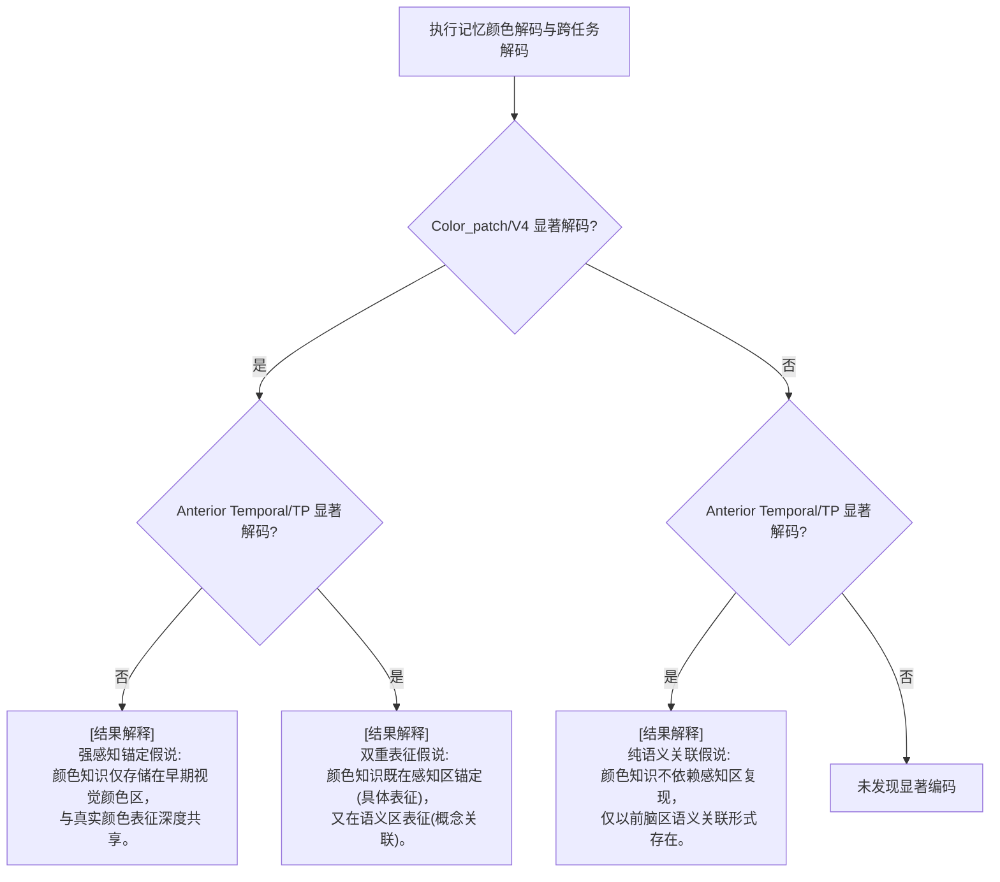

# SEEG 颜色认知研究 — 完整分析方案 (V2 细节优化版)

> **项目根目录**: `/home/lirui/liulab_project/ieeg/Project_colorieeg_2026`
> **新建工作目录**: `color_cognition_pipeline` (独立于 `newanalyse`)
> **核心被试**: test001 (预留 test002, test003 扩展接口)

---

## 目录结构设计

为确保分析管线清晰且独立，将创建以下目录结构：

```
color_cognition_pipeline/
│
├── feature/                 # 重新提取和标准化的特征文件 (ERP, High-Gamma)
│   ├── extract_hg_feature.m  # 连续信号多频段 Hilbert 包络提取与 Epoch 脚本
│   ├── extract_erp_feature.m # ERP 特征提取与 Epoch 脚本
│   └── test001/             # 被试特异性特征数据目录 (.mat 格式)
│
├── pipeline/                # 核心分析脚本和算法实现
│   ├── utils/               # 统计、多重比较校正、绘图等公共工具库
│   ├── step1_localizer.m    # 模块一：Color/Face/Place Patch 定位与空间排布验证
│   ├── step2_validation.m   # 模块二：颜色选择性验证 (Tuning Curve, 亮度排除, 前后梯度)
│   ├── step3_decoding.m     # 模块三：颜色知识神经表征解码 (Within-Category, Cross-Task)
│   ├── step4_true_false.m   # 模块四：真假颜色物体分离与熟悉度分析
│   └── step5_info_flow.m    # 模块五：时序延迟与 CCEP 因果连接整合
│
├── result/                  # 保存运行生成的统计数据和模型结果
│   ├── test001/
│   └── group/               # 多被试组水平分析
│
├── 结果描述/                # 存放生成的图表和中文结果文字分析
│   ├── figures/             # 论文/报告级别可视化图表 (.png, .pdf)
│   └── reports/             # 对应 5 个模块的详细中文分析报告
│
└── 写文章/                  # 撰写论文专用的材料
    ├── method_section.md    # 方法学中英文草稿
    └── figure_legends.md    # 图表标题和说明
```

---

## 预处理与 High-Gamma 特征提取参数

由于需要重新获取 High-Gamma 特征，我们将严格按照“先在全长连续信号上提取包络，后分段，最后基线校正”的顺序，参数设定如下：

*   **重采样**: 500 Hz (Nyquist 频率 250 Hz)。
*   **工频陷波**: 50 Hz, 100 Hz, 150 Hz 的零相位 IIR 凹陷滤波器（消除电网工频干扰）。
*   **重参考**: 混合式局部重参考。
    *   对于电极棒内部触点：使用双侧触点平均进行 Laplician 重参考（即 $Channel_{n} - \frac{Channel_{n-1} + Channel_{n+1}}{2}$）。
    *   对于电极棒两端触点：使用单侧触点进行双极（Bipolar）重参考（即 $Channel_{1} - Channel_{2}$）。
    *   对于孤立触点：保持原样，不进行重参考。
*   **高通滤波**: 1 Hz（去除低频慢漂移和极化电位）。
*   **低通滤波**: 200 Hz（保证在 Nyquist 频率内安全无混叠）。
*   **High-Gamma 子频段划分**: 划分为 8 个连续不重叠的子频段：[70-80, 80-90, 90-100, 100-110, 110-120, 120-130, 130-140, 140-150] Hz。
*   **包络提取算法**:
    1. 在全长连续数据上，对 8 个子频段分别用 4 阶双向巴特沃斯带通滤波器进行滤波。
    2. 使用 Hilbert 变换计算解析信号，并求得瞬时振幅的平方（即瞬时功率）。
    3. 将 8 个子频段的瞬时功率转换到对数域（$\log_{10}$ 变换）以稳定方差。
    4. 对对数域上的 8 个子频段进行算术平均，得到单通道连续的 High-Gamma 功率曲线。
*   **分段 (Epoching)**:
    *   分段区间：刺激呈现前 -500 ms 至呈现后 1000 ms（共计 1500 ms 长度）。
*   **基线校正 (Z-score 变换)**:
    *   基线窗口：-250 ms 到 -50 ms（避免由于滤波边缘效应影响 0ms 前后的响应）。
    *   校正计算：逐 trial、逐通道地使用基线窗口内的均值 ($\mu_{base}$) 和标准差 ($\sigma_{base}$) 进行 Z-score 标准化：
        $$Z(t) = \frac{Power(t) - \mu_{base}}{\sigma_{base}}$$
*   **数据矩阵对齐**:
    *   由于坏段剔除会导致各条件的可用 trial 数不一致，为进行平衡的解码和统计，首先计算所有条件中的最小有效 trial 数 $min\_trials$。
    *   对 trial 数较多的条件，截取其前 $min\_trials$ 个 trial。
    *   最终保存的特征数据为 4D 矩阵，维度为：`[Cond, Rep, Ch, Time]`（即 `[条件数, trial重复数, 通道数, 时间点数]`）。

---

## 模块一：Color Patch 定位与面孔/场景 Patch 联合筛选

### 1.1 定位策略
由于无个体化功能磁共振（fMRI）定位数据，完全依赖 **Task1** 视觉刺激响应进行功能定位。

```
Task1 条件划分：
- Color 条件组 (4个条件)：Face_Color, Object_Color, Body_Color, Place_Color
- Gray 条件组 (4个条件)：Face_Gray, Object_Gray, Body_Gray, Place_Gray
```

#### 1.1.1 颜色选择性（Color Patch）定位逻辑
采用**双层统计检验方案**以实现稳健筛选：
1.  **第一层（Pooled 级比较）**:
    *   将 Color 组的 4 个条件的所有 trial 合并（共 $4 \times min\_trials$ 个试次），将 Gray 组的 4 个条件的所有 trial 合并（共 $4 \times min\_trials$ 个试次）。
    *   计算刺激呈现后早期视觉时间窗 **[80, 300] ms** 和持续响应时间窗 **[100, 500] ms** 内的 High-Gamma 平均 Z-score。
    *   对每个通道进行双样本 $t$ 检验（双尾，$\alpha = 0.05$），筛选出满足 $Color > Gray$ 且效应量 Cohen's $d > 0.5$ 的通道。
2.  **第二层（Per-category 级确认）**:
    *   针对第一层筛选出的通道，分别比较四大类别的单条件：Face_Color vs Face_Gray、Object_Color vs Object_Gray、Body_Color vs Body_Gray、Place_Color vs Place_Gray。
    *   **判定标准**：只有当通道在 Pooled 级比较中显著，且在至少 **2 个** 单类别比较中均表现出显著的 $Color > Gray$ 时，才最终判定为颜色选择性通道（Color-selective channels）。
3.  **多重比较校正**: 对所有 125 个通道进行 False Discovery Rate (FDR, Benjamini-Hochberg) 校正，要求校正后的 $p_{adj} < 0.05$。

#### 1.1.2 面孔与场景选择性（Face/Place Patch）定位逻辑
由于缺乏独立 localizer 数据，同样使用 Task1 数据进行功能定位：
*   **面孔选择性 (Face-selective)**:
    *   合并所有 Face 试次（Face_Color + Face_Gray）作为目标组，合并所有非面孔试次（Object、Body、Place 的 Color 与 Gray）作为对照组。
    *   在 **[100, 400] ms** 时间窗内计算双样本 $t$ 检验，要求满足 $Face > Non\text{-}Face$，效应量 $d > 0.5$，且经 FDR 校正后 $p_{adj} < 0.05$。
*   **场景选择性 (Place-selective)**:
    *   合并所有 Place 试次（Place_Color + Place_Gray）作为目标组，合并所有非场景试次（Face、Object、Body 的 Color 与 Gray）作为对照组。
    *   在 **[100, 400] ms** 时间窗内计算双样本 $t$ 检验，要求满足 $Place > Non\text{-}Place$，效应量 $d > 0.5$，且经 FDR 校正后 $p_{adj} < 0.05$。

### 1.2 “三明治”空间分布验证
*   **解剖预期位置**: 根据先验，Color Patch 主要沿梭状回（Fusiform Gyrus）和侧副沟（Collateral Sulcus）分布，在解剖层级上对应人类的 V4_c/TEO_c 区域。
*   **三明治假说**: 颜色小生境（Color Patch）通常在前后方向上被面孔小生境（Face Patch，如 FFA）和场景小生境（Place Patch，如 PPA）夹在中间。
*   **验证方法**:
    1. 提取定位出的 Color-selective、Face-selective 和 Place-selective 通道的 MNI 坐标（重点关注 Y 轴前后坐标，以及 X 轴左右半球）。
    2. 绘制电极触点在 MNI 空间中的 3D 渲染图（使用电极定位表中的坐标）。
    3. 进行统计检验：比较三类通道在 Y 轴上的均值分布，验证是否满足：
       $$Y_{Place} < Y_{Color} < Y_{Face} \quad (\text{后部} \rightarrow \text{前部})$$
       或
       $$Y_{Face} < Y_{Color} < Y_{Place}$$
       具体分布次序取决于电极触点在颞下回的具体投影。
    4. **与先验 ROI 对比**: 计算我们筛选的功能性 Color 通道与用户已有的解剖先验 `Color_patch`（基于 fMRI mask）以及 `Color_with_sti`（电刺激产生光幻视位点）的重合率（Overlap Ratio）。

---

## 模块二：颜色选择性验证与调谐分析

### 2.1 颜色调谐曲线 (Tuning Curve) 绘制
使用 **Task3** 的 6 种色块刺激数据（Red, Yellow, Blue, Green, Black, White）：

1.  **特征值提取**:
    *   对在模块一中定位出的每个 Color-selective 通道，提取其在 Task3 各个色块刺激后 **[80, 300] ms** 窗口内的 High-Gamma 平均 Z-score 响应值。
2.  **响应归一化**:
    *   为消除不同电极间绝对响应幅值的差异，对每个通道在 6 个条件下的响应值进行 Min-Max 归一化或标准化：
        $$R'_{cond} = \frac{R_{cond} - \min(R)}{\max(R) - \min(R)}$$
3.  **曲线绘制**:
    *   绘制以 [Red, Yellow, Green, Blue] 为横坐标的颜色调谐折线图，或在极坐标系下绘制调谐圆环图。计算极轴角和向量振幅，确定该通道的**偏好颜色 (Preferred Color)** 及**调谐特异性 (Tuning Width)**。

### 2.2 亮度敏感性控制分析
*   **设计事实**: 实验设计中已在受试者间对彩色色块进行了**主观亮度匹配**。因此，彩色色块之间的物理主观亮度差异已得到极大控制。
*   **验证方案**:
    *   在定位出的通道上，比较彩色色块内部的变异度与黑白（纯极度亮度）变异度。
    *   使用单因素方差分析（ANOVA），自变量为 6 个色块条件。若彩色色块内部响应具有显著差异（调谐），且彩色响应显著偏离无色基线（Black/White），则可证明该通道编码的是色度信息（Chromaticity）而非简单的光强/亮度。

### 2.3 颜色选择性后-前梯度验证
*   **计算指标**:
    *   每个通道的**颜色选择性指数 (CSI)**：
        $$CSI = \frac{\overline{HG}_{Color} - \overline{HG}_{Gray}}{\overline{HG}_{Color} + \overline{HG}_{Gray}}$$
        （其中 $\overline{HG}$ 为刺激后 [80, 300] ms 的 High-Gamma 原始功率均值）。
*   **相关性分析**:
    *   提取所有视觉响应通道的 MNI Y 轴坐标（表征从后到前的位置）。
    *   计算 CSI 与 Y 轴坐标之间的 Spearman 秩相关系数 $\rho$。
    *   **预期趋势**: 负相关，即随着 Y 坐标增大（位置向前移动，趋向前颞叶），CSI 逐渐降低（这与猕猴后部视觉皮层到前颞叶颜色选择性逐渐退化的发现一致）。

---

## 模块三：颜色知识的神经表征与解码分析

本模块是研究的核心，用于验证**感知锚定假说 (Perceptual Grounding)** 与**语义关联假说 (Semantic Association)**。

### 3.1 Task2 条件定义与分组
Task2（水果记忆颜色实验）在预处理后包含 **12 个条件**（4 种水果：草莓、猕猴桃、卷心菜、西瓜 × 3 种颜色状态：True color、False color、Gray）。

对 Gray 条件（灰度水果，无视网膜颜色输入，仅有记忆颜色）按其真实世界的固有颜色进行分组：
*   **“红色记忆”组**: 草莓_Gray + 西瓜_Gray
*   **“绿色记忆”组**: 猕猴桃_Gray + 卷心菜_Gray

### 3.2 记忆颜色时间分辨解码 (Within-Category Decoding)
*   **目的**: 验证在没有真实颜色刺激输入时，脑区是否编码了物体的固有“记忆颜色”。
*   **方法**:
    1.  **特征输入**: 选定 ROI（如 Color_patch、V4、Temporal_Pole 等）内所有通道的 High-Gamma Z-score 信号。
    2.  **滑动时间窗**: 使用 **50 ms** 的滑动时间窗，步长为 **10 ms**。在每个窗口内，将时间点的数据展平或取平均作为分类特征。
    3.  **分类器**: 线性支持向量机 (Linear SVM) 或线性判别分析 (LDA)。
    4.  **交叉验证**: 5 折交叉验证（5-fold CV），重复运行 10 次以消除随机划分的影响。
    5.  **计算运行模式**:
        *   **快速模式 (Fast Mode)**: 分类器仅执行一次真实的交叉验证，不运行置换检验。用于快速验证代码逻辑和获取初步解码率趋势线。
        *   **完整模式 (Full Mode)**: 在快速模式基础上，进行 **1000 次置换检验 (Permutation Test)**。在每次置换中，随机打乱试次的“红色记忆/绿色记忆”标签，重新训练分类器，构建零分布。
    6.  **统计显著性**: 采用 Cluster-based Permutation Test 对解码时间曲线进行多重比较校正，寻找解码准确率（AUC 或 Accuracy）显著高于 50% 随机水平的时间窗口。

### 3.3 跨任务解码分析 (Cross-Task Decoding)
*   **目的**: 寻找“记忆颜色”与“真实颜色”共享神经编码表征的直接证据（即感知锚定）。
*   **方法**:
    *   **训练集 (真实颜色)**: Task3 中的真实红色色块 vs 真实绿色色块试次。
    *   **测试集 (记忆颜色)**: Task2 中的灰度水果（“红色记忆”组 vs “绿色记忆”组）试次。
    *   **分析 A（对角线解码）**:
        *   在每个时间点 $t$ 用 Task3 数据训练分类器，直接在 Task2 的对应时间点 $t$ 进行测试。
    *   **分析 B（时间泛化矩阵 TGM）**:
        *   在 Task3 的时间点 $t_{train}$ 训练分类器，在 Task2 的时间点 $t_{test}$ 进行测试，绘制二维时间泛化矩阵。
    *   同样提供**快速模式**（只跑一次）与**完整模式**（1000次置换检验及 Cluster 校正）。

### 3.4 假说检验与结果解释逻辑

通过比对不同 ROI 的解码结果，判定颜色知识的存储机制：



*   **CSI 与解码率的相关性**: 对所有通道，计算其在 Task1 中的 CSI 值与在 Task2 记忆颜色解码中的峰值解码率（AUC）之间的 Spearman 相关。如果两者呈现显著正相关，将直接证明“颜色选择性越高的位点，越强地参与记忆颜色的提取”，从而为感知锚定假说提供关键佐证。

---

## 模块四：真/假颜色物体分离与语义熟悉度分析

使用 **Task2** 中的真彩色物体（如红草莓、绿猕猴桃）与假彩色物体（如绿草莓、红猕猴桃）数据。

```
条件合并定义：
- True-color 试次组：草莓_True + 猕猴桃_True + 卷心菜_True + 西瓜_True
- False-color 试次组：草莓_False + 猕猴桃_False + 卷心菜_False + 西瓜_False
```

### 4.1 True vs False 信号响应差异
*   **分析方法**:
    *   在每个 ROI（尤其是 Color_patch 和 Temporal_Pole）上，绘制 True-color 和 False-color 试次的平均 High-Gamma Z-score 响应曲线。
    *   对每个时间点进行双样本 $t$ 检验，并进行 Cluster-based 统计校正。
*   **理论预测**:
    *   在前脑区（如 **Temporal_Pole, TP**）：由于 True-color 物体符合先验知识，表现出更高的熟悉度，预期会出现显著的 $True > False$ 的熟悉度响应（Familiarity Effect）。
    *   在早期视觉区（如 **Color_patch**）：由于视网膜输入都是彩色刺激，两者的物理属性类似，预期不会表现出明显的平均响应差异。

### 4.2 True vs False 的二分类解码
*   **方法**:
    *   在各个 ROI 内训练分类器区分 True vs False。
    *   **Within-object 解码**: 在单一物体内（如草莓_True vs 草莓_False）进行解码。
    *   **Cross-object 泛化解码**: 在物体 A（如草莓、猕猴桃）上训练分类器区分 True vs False，在物体 B（如卷心菜、西瓜）上进行测试。
    *   **解释**: 跨物体的成功解码将证明该脑区存在抽象的“概念熟悉度/冲突检测”编码，而不仅仅是物体形状或物理颜色的差异。

### 4.3 短期熟悉化学习效应验证
*   **假说**: 随着实验的进行，受试者反复观看假彩色物体（如绿草莓），其大脑对这些不合理物体的惊奇度（Surprise）会下降，语义熟悉度会增加。
*   **方法**:
    1. 将每个被试的 Task2 试次序列按时间序列平分为两半：前半段（Early Phase）与后半段（Late Phase）。
    2. 分别在 Early Phase 和 Late Phase 计算前脑区（TP）的 $True - False$ 的 High-Gamma 差异强度。
    3. 比较两个阶段的差异。若 Late Phase 的差异显著减小，则证实了“前脑区对物体-颜色冲突具有短期学习与自适应熟悉效应”。

---

## 模块五：时序延迟与 CCEP 因果网络整合

### 5.1 响应延迟分析 (Onset Latency)
*   **定义**: 刺激呈现后，High-Gamma 功率曲线显著偏离基线的第一时间点。
*   **计算算法**:
    *   对每个通道，使用单样本 $t$ 检验逐时间点比较 Z-score 是否显著大于 0。
    *   **延迟起点标准**：连续至少 **15 个时间点 (30 ms)** 满足 $p < 0.01$ 的第一时间点。
*   **预期顺序**:
    *   后部视觉区 ($V2/V4$) $\rightarrow$ 中间梭状回 ($Color\_patch$) $\rightarrow$ 前颞叶 ($Temporal\_Pole$)
    *   比较这三类区域的 Onset Latency 均值，进行单因素 ANOVA 检验。

### 5.2 基于 CCEP 的有效连接图谱整合
test001 拥有皮层-皮层诱发电位（CCEP）数据，这为信息流向提供了直接的物理通路证据。

1.  **CCEP 连接矩阵构建**:
    *   提取刺激电极在每个响应电极上产生的 CCEP 诱发波形（通常关注刺激后 10-100 ms 内的 $N1$ 或 $P1$ 峰值）。
    *   以 CCEP 诱发幅值或信号噪声比（SNR）作为有效连接强度的量化指标，构建有向的物理连接矩阵 $A_{CCEP}$。
2.  **网络通路融合**:
    *   将 CCEP 发现的有向连接路径，与视觉任务中推导的信息流时序进行融合。
    *   **计算融合相关性**:
        *   如果在任务中，区域 A（如 V4）到区域 B（如 Color_patch）存在时序超前或因果流动，检验这是否与 CCEP 矩阵中 $A \rightarrow B$ 的物理投射强度成正比。
    *   通过此融合，可构建一个包含解剖连接（MNI）、物理有效连接（CCEP）和任务特异性信息流（HG 延迟与 Granger 因果）的三位一体脑网络模型。

---

## 多被试与模块化代码实现规划

1.  **多被试接口**:
    *   在 `pipeline/` 中编写全局配置 `config_pipeline.m`：
        ```matlab
        cfg.subjects = {'test001', 'test002', 'test003'};
        cfg.fs = 500;
        cfg.hg_window = [80, 300]; % ms
        cfg.decoding_window = [-200, 800]; % ms
        ```
    *   所有分析脚本使用以 `subject` 为循环变量的结构，动态加载对应文件夹中的特征矩阵和通道电极定位表。
2.  **通道适配与缺失处理**:
    *   对于没有特定 ROI（如有些被试可能没有覆盖 `Color_with_sti` 或 `Temporal_Pole`）的被试，代码中应包含容错机制：当检查到该 ROI 的可用通道数为 0 时，自动跳过此 ROI 的组统计，但不中断脚本运行。
3.  **计算资源优化**:
    *   所有的滑动窗 Decoding 函数均提供 `run_mode` 参数。在调试和初步探索阶段设为 `'fast'`；在生成最终论文和报告图表时设为 `'full'` 以进行 1000 次置换检验。

---

## 验证计划

此方案仅做设计，执行前需要用户确认以下细节：

1.  **参数合理性**: 高通1Hz、低通200Hz、HG子段[70-150]Hz、基线校正窗口[-250, -50]ms，以及滑窗50ms、步长10ms是否均符合您的预期？
2.  **Tuning Curve 特征选择**: 采用刺激后 [80, 300] ms 的 High-Gamma Z-score 均值响应，并进行 Min-Max 标准化，该方案是否可行？
3.  **数据目录与命名**: 确认新创建的 `color_cognition_pipeline` 目录结构及其包含的五个子文件夹命名是否合适？
