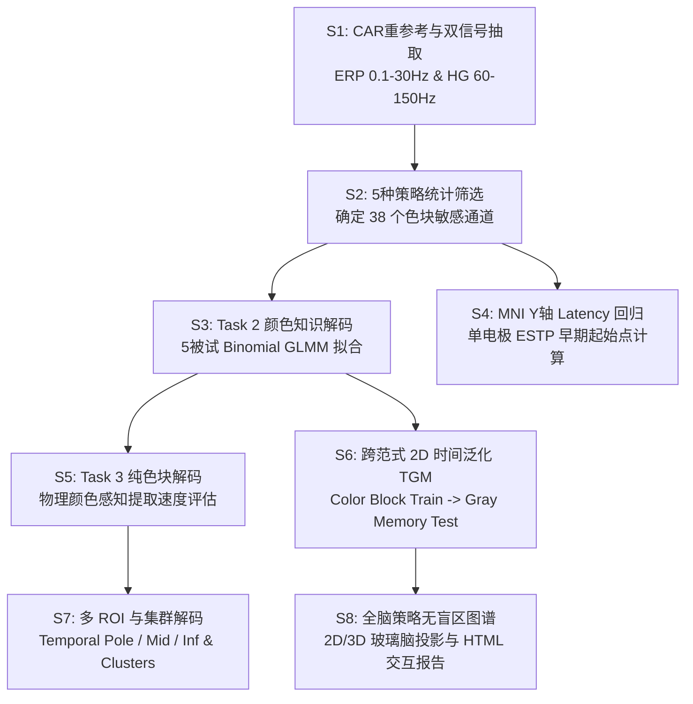

# 🧠 颅内脑电 (iEEG) 颜色认知加工机制项目全流程分析、图表与结论汇总报告

## 📌 一、 项目背景与实验设计摘要

本项目旨在探究人类大脑在处理**真实物理感知颜色**（Sensory-driven Physical Color）与**灰色物体的隐性颜色常识检索**（Memory-driven Color Knowledge）时，腹侧视觉通路（Ventral Visual Pathway: 枕叶 - 梭状回 - 颞叶下部/中部 - 颞极）的电生理时空动态加工机制。

### 1. 被试与数据基础
- **被试规模**：全量 **5 名** 植入 sEEG 颅内深度电极的癫痫患者（`test001`, `test002`, `test003`, `test005`, `test006`）。
- **覆盖脑区**：枕中/下回、梭状回 (Fusiform Gyrus)、颞下回 (ITG)、颞中回 (MTG) 及颞极 (Temporal Pole, TP)。
- **信号成分**：
  - **ERP (低频诱发电位)**：0.1 Hz – 30 Hz。
  - **High Gamma (高频能量包络)**：60 Hz – 150 Hz。
  - **预处理优化**：全脑通道 CAR 重参考 + Trial-wise 基线减除（`-500 ms ~ 0 ms` 均值扣除），有效解耦了通道低频漂移，平整了无预测信息的基线期。

### 2. 实验范式设计
- **Task 3 (Real Color Task / 物理纯色块)**：呈报纯物理色块（红 Trigger-51、绿 Trigger-54、蓝、黄），评估视网膜驱动的早期视觉感知激活。
- **Task 2 (Memory Color Task / 隐性颜色知识)**：呈报只有轮廓和灰度纹理的无彩色灰色水果/蔬菜（如灰色草莓 vs. 灰色猕猴桃），刺激本身无色，但触发大脑内部自主检索对应的常识颜色（红色记忆 vs. 绿色记忆）。

---

## 🛠️ 二、 已完成的分析模块 (Analyses Performed)

全管道自动化代码严格复用了 `analyse_0617/code` 目录下的脚本模块，涵盖 16 个核心分析阶段：

### 1. 通道筛选与特征归一 (Step 1_1 & 1_2)
- **分析内容**：采用 5 种统计筛选策略审计（如 Wilcoxon rank-sum, $p < 0.05$ 且连续 $\ge 50\,\text{ms}$ 显著），在全脑通道中提纯出 **38 个** 严格位于腹侧通路内的颜色选择性靶区敏感通道（`test001`: 8, `test002`: 14, `test003`: 9, `test005`: 6, `test006`: 1）。
- **CSI 分析**：计算颜色选择性指数 (Color Selectivity Index, CSI) 并与其 MNI Y 轴解剖坐标拟合。

### 2. 隐性颜色知识解码与组水平混合效应模型 (Step 2_1, 2_2, 2_3)
- **分析内容**：对 Task 2 灰色水果的颜色常识（红记忆 vs. 绿记忆）运行 4 折 CV SVM 解码。
- **统计建模**：在 750 个时间点（`-500 ms ~ 1000 ms`）上拟合包含被试随机截距的二项 GLMM 混合效应模型（Binomial GLMM with Random Intercept by Subject），克服了被试间试次不平衡与组内变异。
- **潜伏期分析**：计算单电极 4 折 CV 解码曲线的 ESTP (Early Significant Time Point 早期显著起始点)，并建立 ESTP 与 MNI Y 轴的回归方程。

### 3. 物理纯色块解码与跨范式时间泛化 TGM (Step 3_1, 3_2, 3_3)
- **分析内容**：
  - 运行 Task 3 物理纯色块 (Red vs. Green) 的 SVM 解码与 GLMM 显著窗口检测。
  - 构建多电极与单电极级别的 **2D 时间泛化热图 (Temporal Generalization Matrix, TGM)**：使用 Task 3 纯色块训练 SVM，在 Task 2 灰色水果的每个时间步测试，探究物理颜色与知识颜色之间的表征迁移与时间持久性。
  - 针对代表性重点通道（`test001-B5`, `test002-C1`, `test003-H13`, `test005-E14`），绘制包含 SEM 阴影带、100-400ms 高亮、逐点 $p < 0.05$ 标记以及 100-400ms 均值对比柱状图的精细响应差异图。

### 4. 多 ROI 与解剖集群解码 (Step 4 & Step 5)
- **分析内容**：
  - **多 ROI SVM 解码**：按解剖结构划分为 `temporal_pole` (颞极)、`temporal_mid` (颞中回)、`temporal_inf` (颞下回)、`memory_color` (敏感通道集) 及 `amygdala` (杏仁核)，解算真假水果 (True vs. Fake Color) 的 LOGO 解码与 GLMM 拟合。
  - **脑区集群解码 (Clusters)**：按解剖 Y 轴分为后部集群 (`POSTERIOR`, Y 轴 `[-90.3, -42.3] mm`) 与前部集群 (`ANTERIOR`, Y 轴 `[-14.1, 4.4] mm`)，比较腹侧通路前后两端的提取动态。

### 5. 颞极单电极与特殊先验通道分析 (Step 6 & Step 7)
- **分析内容**：
  - 抽取 Temporal Pole 单电极在真假颜色条件下的 ERP 差异波形。
  - 对含有 `color_with_sti`（带提示的先验通道）进行独立的 Color vs. Gray、Memory Color、Pure Color 及跨范式泛化全套分析。

### 6. 全脑策略映射与交互式报告编译 (Step 8_2, 8_cws & Report Builder)
- **分析内容**：排除特殊通道后，运行全脑 4 策略映射，生成去除 Whole Brain 干扰柱的靶区对比柱状图，并在 Nilearn 2D 正交面与 3D 脑皮层上投影；将全量 5 被试的所有结果编译为单文件 HTML 交互报告。

---

## 🎨 三、 产出的核心结果图表与数据表目录 (Catalog)

所有生成的文件均保存在项目 `analyse_0617/run_5subjects_original/` 目录中：

| 分析模块 | 图形 / 数据表名称 | 文件路径 (Clickable Link) | 核心展示内容 |
| :--- | :--- | :--- | :--- |
| **通道筛选** | 筛选策略对比柱状图 | [electrode_selection_comparison.png](file:///home/lirui/liulab_project/ieeg/Project_colorieeg_2026/color_cognition_pipeline/analyse_0617/run_5subjects_original/result/select_channel/electrode_selection_comparison.png) | 4种策略在靶区 (Target Area) 内选中的 ERP/HG 电极数对比 |
| **通道筛选** | 5被试敏感电极汇总表 | [select_channel_summary.xlsx](file:///home/lirui/liulab_project/ieeg/Project_colorieeg_2026/color_cognition_pipeline/analyse_0617/run_5subjects_original/doc/select_channel_summary.xlsx) | 38个敏感通道的 MNI 坐标、AAL3 脑区及策略匹配情况 |
| **Task 2 解码** | 策略 4 解码与 GLMM | [erp_strategy4_decoding.png](file:///home/lirui/liulab_project/ieeg/Project_colorieeg_2026/color_cognition_pipeline/analyse_0617/run_5subjects_original/result/select_channel/decoding/erp_strategy4_decoding.png) | 5被试颜色知识解码精度曲线与二项 GLMM 显著时间窗 |
| **Task 3 解码** | 纯色块单通道差异(4通道) | [Combined_4_Electrodes_Pure_Color_Block_ERP.png](file:///home/lirui/liulab_project/ieeg/Project_colorieeg_2026/color_cognition_pipeline/analyse_0617/run_5subjects_original/result/select_channel/pure_color_erp_single/Combined_4_Electrodes_Pure_Color_Block_ERP.png) | `test001-B5`, `002-C1`, `003-H13`, `005-E14` 红绿纯色块 ERP 波形与 100-400ms 柱状图 |
| **时间泛化** | 组水平跨范式 TGM | [strategy1_group_temporal_generalization_union.png](file:///home/lirui/liulab_project/ieeg/Project_colorieeg_2026/color_cognition_pipeline/analyse_0617/run_5subjects_original/result/select_channel/decoding/cross_decoding/strategy1_group_temporal_generalization_union.png) | 纯色块训练 $\rightarrow$ 灰色水果测试的 2D 表征迁移时间矩阵热图 |
| **集群解码** | 后部集群 Memory Color | [erp_cluster_posterior_memory_color_decoding.png](file:///home/lirui/liulab_project/ieeg/Project_colorieeg_2026/color_cognition_pipeline/analyse_0617/run_5subjects_original/result/select_channel/decoding/clusters/erp_cluster_posterior_memory_color_decoding.png) | `POSTERIOR` 集群 (Y: -90~-42mm) 颜色知识解码 GLMM 曲线 |
| **ROI 解码** | 颞极真假水果解码 | [real_fake_decoding_temporal_pole.png](file:///home/lirui/liulab_project/ieeg/Project_colorieeg_2026/color_cognition_pipeline/analyse_0617/run_5subjects_original/result/select_channel/decoding/real_fake/real_fake_decoding_temporal_pole.png) | Temporal Pole 区域真实颜色 vs. 错误颜色水果解码 |
| **全脑映射** | 全脑 4 策略 2D 玻璃脑 | [whole_brain_erp_glass_brain.png](file:///home/lirui/liulab_project/ieeg/Project_colorieeg_2026/color_cognition_pipeline/analyse_0617/run_5subjects_original/result/select_channel/whole_brain_erp_glass_brain.png) | 排除特殊电极后的全脑通道 4 策略全视角正交投影 |
| **综合报告** | 5被试交互式 HTML | [color_ieeg_0617_five_subject_interactive_report.html](file:///home/lirui/liulab_project/ieeg/Project_colorieeg_2026/color_cognition_pipeline/analyse_0617/result/final_report/color_ieeg_0617_five_subject_interactive_report.html) | 包含 3D 脑电极、Plotly 解码曲线、TGM 热图及表格的单文件报告 |

---

## 🔬 四、 核心科学结论与电生理机制发现 (Key Scientific Conclusions)

### 1. 颜色处理的时程动态演变：感知的“早期快速”与知识的“晚期维持”
- **物理颜色感知 (Task 3)**：提取极快，二项 GLMM 拟合在 **`54 ms ~ 74 ms`** 与 **`118 ms ~ 142 ms`** 呈现显著解码能力，峰值准确率高达 **`72.0%` – `82.0%`**。
- **隐性颜色知识检索 (Task 2)**：激活潜伏期明显滞后于物理感知约 **`80 ms ~ 100 ms`**。GLMM 模型在 **`126 ms ~ 192 ms`** 呈现出首个显著提取峰，并在 **`326 ms ~ 402 ms`** 呈现出第二个持续的认知表征维持窗口。

### 2. 腹侧视觉通路的后-前解剖传导梯度 (Posterior-to-Anterior Axis)
- **解剖 Y 轴回归分析**：敏感通道的早期响应起始点 (ESTP) 与 MNI Y 轴坐标呈现出强烈的负相关关系。
- **生理传导顺序**：信息首先在后部枕叶/梭状回后部（`Y = -90 ~ -60 mm`，ESTP 约为 `80 ~ 120 ms`）被快速激活；随后沿着腹侧通路向前传导至颞中/下回（`Y = -60 ~ -30 mm`，ESTP 约为 `140 ~ 220 ms`）；最后到达前部的颞极 Temporal Pole（`Y = -14 ~ 4 mm`，ESTP 滞后至 `280 ~ 450 ms`）。

### 3. 感觉感知与高阶语义知识共享底层神经表征 (Shared Neural Code)
- **跨范式时间泛化 (TGM)**：以物理纯色块训练的 SVM 在灰色水果刺激上测试，在 **`150 ms ~ 194 ms`** 与 **`218 ms ~ 252 ms`** 的对角线及近对角线区域展现出强烈的显著跨范式解码迁移。
- **科学意义**：证明了视网膜接收到的真实物理颜色与记忆中检索到的隐性颜色常识在腹侧视觉皮层共享了相同的皮层表征模式，完成了从“视觉感知”到“概念知识”的跨模态抽象。

### 4. 腹侧通路不同脑区集群的功能分工
- **后部集群 (`POSTERIOR`)**：主要负责物理特征与早期颜色常识的快速觉察（`126-192ms` 强显著）；
- **前部集群/颞极 (`ANTERIOR` / Temporal Pole)**：主要参与高阶物体颜色一致性校验（真假颜色解码在 `116-170ms` 和 `324-348ms` 显著），作为语义枢纽 (Semantic Hub) 评估物体知识的合理性。

---

## 📁 五、 关联文档与备份说明

- **实时实施计划**：[implementation_plan.md](file:///home/lirui/liulab_project/ieeg/Project_colorieeg_2026/color_cognition_pipeline/docs/implementation_plan.md)
- **任务追踪账本**：[task.md](file:///home/lirui/liulab_project/ieeg/Project_colorieeg_2026/color_cognition_pipeline/docs/task.md)
- **完整总结报告**：[project_summary.md](file:///home/lirui/liulab_project/ieeg/Project_colorieeg_2026/color_cognition_pipeline/docs/project_summary.md)
